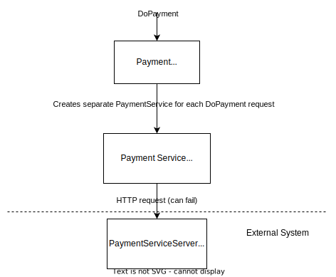

# Lab 5 - Handling failures, Akka Actor Discovery with Akka Cluster and Akka HTTP

## Handling actor errors

* to gracefully handle actor failures Akka uses _Supervision and Monitoring_ [patterns](https://doc.akka.io//docs/akka/current/general/supervision.html) 
* [Fault Tolerance in Akka](https://doc.akka.io//docs/akka/current/typed/fault-tolerance.html)
* **Note** there were significant differences introduced in Akka Typed version regarding error handling. You can read more [here](https://akka.io/blog/article/2019/02/05/typed-supervision)

## Sending messages to actors on a different machine

* [Akka Location Transparency](https://doc.akka.io//docs/akka/current/general/remoting.html#remoting) 
* [Akka Actor Discovery](https://doc.akka.io/docs/akka/current/typed/actor-discovery.html) can be implemented with the [receptionist pattern](https://doc.akka.io/docs/akka/current/typed/actor-discovery.html#receptionist). See [Bank.scala](src/main/scala/reactive5/Bank.scala) for an example.
* **Note** In Akka Typed, there is no way to contact actors on a different machine with actors' paths (support was dropped as it is usually a bad idea to contact actors directly via the path). You can communicate between machines transparently using Akka Cluster capabilities.
* Cluster settings can be found in [application.conf](src/main/resources/application.conf)

## Supporting the HTTP communication with Akka HTTP

* For HTTP communication (both server and client) the [Akka HTTP](https://doc.akka.io/docs/akka-http/current/index.html?language=scala) library can be used.
* Take a look and try to run [HttpServer](src/main/scala/reactive5/HttpServer.scala) and then [HttpClient](src/main/scala/reactive5/HttpClient.scala)
* Server uses high level DSL to compose HTTP route, [see](https://doc.akka.io/docs/akka-http/current/routing-dsl/index.html?language=scala#minimal-example)
* Client is an actor which makes a request and then pipes the HTTP response to itself

## Assignment

The template for Lab 5: https://github.com/agh-reactive/reactive-scala-labs-templates/tree/lab-5 
* **be sure that your local lab-5 branch is up to date with remote one**
* **remember about merging solution from lab-4 into this branch**

In the template, [`ProductCatalog`](https://github.com/agh-reactive/reactive-scala-labs-templates/blob/lab-5/src/main/scala/EShop/lab5/ProductCatalogApp.scala) has been implemented. An example of communication with `ProductCatalog` from a different `ActorSystem` using the [receptionist pattern](https://doc.akka.io/docs/akka/current/typed/actor-discovery.html#receptionist) with cluster setup is implemented in [ProductCatalogRemoteTest.scala](https://github.com/agh-reactive/reactive-scala-labs-templates/blob/lab-5/src/test/scala/EShop/lab5/ProductCatalogRemoteTest.scala). Product catalog has several responsibilities:
* storing `Item`s, accordingly to lab4 convention (id as URI), and with number of items in the warehouse
* searching for items by keywords
    * Example of products: 

    | name | brand  |
    |-----|------|
    | Frappuccino Coffee Drink | Starbucks |
    | Moisturizing Cream | Gerber |
    | 32 New Disposable Razor Twin Blades | Gillette |
    | Coke Classic Bottles |Coca-Cola |

    * Query example: `gerber cream` - brand name following the product name.
    * As a result, 10 closest results are returned.
    * Data is imported from `query_result.bz2` file committed into template resources (data is loaded into memory, so `ProductCatalog` is memory intensive).

1. *(15 points)* Please create Rest API for `ProductCatalog` exposing search feature. Results should be returned as JSON. Run `ProductCatalog` on an actor system different than HTTP server (to demonstrate remote communication via the receptionist pattern). While implementing Akka HTTP server, please take a look at `HelloWorldAkkaHttpServer` example in templates.

2. *(10 points)* Implement the `Payment` actor that communicates with external payments services via HTTP (e.g. VISA, PayU, PayPal) - use the `PaymentService`. The payment server `PaymentServiceServer` is implemented for you - please start it before testing. Use a separate `PaymentService` actor for each payment request.

3. *(15 points)* Add proper payment error handling. Use strategy [supervising](https://doc.akka.io/docs/akka/current/typed/fault-tolerance.html) for Server transient errors, [watch](https://doc.akka.io/docs/akka/current/typed/actor-lifecycle.html#watching-actors) actor for unrecoverable errors and notifying external actors about the payment rejection. [See this](https://manuel.bernhardt.io/2019/09/05/tour-of-akka-typed-supervision-and-signals).

